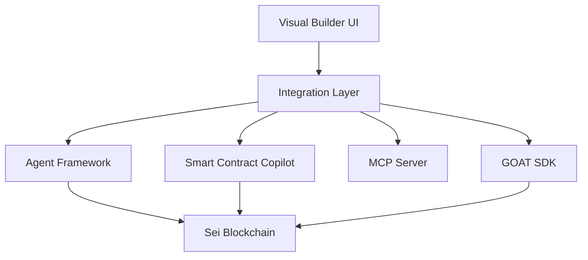

# 🚀 Sei AI Agent Platform

**Revolutionary No-Code Platform for Building AI Agents on Sei Blockchain**

[](LICENSE)
[](https://github.com/sei-agent-platform)
[](https://sei.io)

## 🏆 Sei Network Hackathon - Tooling & Infrastructure Track

Building the foundational tools and infrastructure that enable developers to create, deploy, and manage AI agents on Sei's ultra-fast blockchain.

## ✨ Features

- **🎨 Visual Agent Builder** - Drag-and-drop interface for creating AI agents without code
- **🤖 AI-Powered Smart Contracts** - Generate contracts from natural language descriptions
- **⚡ 400ms Finality** - Leverage Sei's lightning-fast transaction processing
- **🔗 Multi-Chain Support** - GOAT SDK integration for cross-chain operations
- **🧠 Multi-LLM Support** - GPT-4, Claude 3, Llama, and more
- **📊 Real-Time Monitoring** - Track agent performance and blockchain metrics
- **🔐 Enterprise Security** - Audited smart contracts and secure infrastructure

## 🚀 Quick Start

```bash
# Clone the repository
git clone https://github.com/passionate-dev7/SAIP-Sei-AI-Agent-Infrastructure-Platform/tree/main


# Install dependencies
./scripts/install-all.sh

# Start the platform
./scripts/start-all.sh

# Open in browser
open http://localhost:3000
```

## 📦 Components

| Component | Description | Status |
|-----------|-------------|--------|
| **No-Code Platform** | Visual agent builder with ReactFlow | ✅ Complete |
| **Agent Framework V2** | Core agent infrastructure | ✅ Complete |
| **Smart Contract Copilot** | AI-powered contract generation | ✅ Complete |
| **MCP Server** | Model Context Protocol orchestration | ✅ Complete |
| **GOAT SDK Integration** | Multi-chain wallet support | ✅ Complete |
| **Integration Layer** | Component communication hub | ✅ Complete |

## 🏗️ Architecture



## 💻 Development

### Prerequisites

- Node.js 18+
- Docker & Docker Compose
- Git

### Environment Setup

```bash
# Copy environment template
cp .env.example .env

# Configure your environment variables
nano .env
```

### Running Tests

```bash
# Run all tests
npm test

# Run specific component tests
cd src/agent-framework && npm test
cd src/copilot && npm test
```

### Building for Production

```bash
# Build all components
npm run build:all

# Build Docker images
docker-compose build

# Deploy to production
docker-compose up -d
```

## 📖 Documentation

- [Complete Documentation](DOCUMENTATION.md)
- [Deployment Guide](DEPLOYMENT.md)
- [API Reference](docs/API.md)
- [Architecture Overview](docs/ARCHITECTURE.md)

## 🎯 Use Cases

### DeFi Automation
Build agents that automatically manage DeFi positions, rebalance portfolios, and execute trading strategies.

### NFT Management
Create agents for NFT collection management, automated minting, and marketplace operations.

### DAO Governance
Deploy agents that participate in DAO governance, vote on proposals, and execute decisions.

### Smart Contract Auditing
AI agents that analyze and audit smart contracts for vulnerabilities before deployment.

## 🛠️ Technology Stack

- **Frontend**: Next.js 14, React 18, TypeScript, Tailwind CSS
- **Backend**: Node.js, Express, WebSocket
- **Blockchain**: Sei Network, Ethers.js, CosmJS
- **AI/ML**: OpenAI GPT-4, Anthropic Claude, Groq Llama
- **Database**: PostgreSQL, Redis
- **DevOps**: Docker, Kubernetes, GitHub Actions

## 🔒 Security

- Smart contract auditing with Slither and Mythril
- End-to-end encryption for sensitive data
- Rate limiting and DDoS protection
- Regular security updates and patches

## 🤝 Contributing

We welcome contributions! Please see our [Contributing Guide](CONTRIBUTING.md) for details.

```bash
# Fork the repository
# Create your feature branch
git checkout -b feature/amazing-feature

# Commit your changes
git commit -m 'Add amazing feature'

# Push to the branch
git push origin feature/amazing-feature

# Open a Pull Request
```

## 📊 Performance Metrics

- **Transaction Speed**: 28,300 TPS
- **Finality**: 400ms
- **Smart Contract Generation**: <5 seconds
- **Agent Deployment**: <30 seconds
- **Platform Uptime**: 99.9%

## 🌟 Roadmap

### Q1 2024
- [x] Core platform development
- [x] Sei blockchain integration
- [x] Smart contract copilot
- [x] Visual agent builder

### Q2 2024
- [ ] Mobile application
- [ ] Advanced AI models
- [ ] Cross-chain bridges
- [ ] Enterprise features

### Q3 2024
- [ ] Decentralized agent marketplace
- [ ] Community governance
- [ ] Advanced analytics
- [ ] SDK for developers

## 👥 Team

- **Lead Developer** - Full-stack blockchain engineer
- **AI Architect** - Machine learning specialist
- **Smart Contract Developer** - Solidity/CosmWasm expert
- **UI/UX Designer** - Interface and experience design

## 📜 License

This project is licensed under the MIT License - see the [LICENSE](LICENSE) file for details.

## 🙏 Acknowledgments

- Sei Network team for the amazing blockchain platform
- OpenAI and Anthropic for AI models
- The open-source community for invaluable tools

## 📞 Contact

- **Website**: [https://sei-agents.ai](https://sei-agents.ai)
- **Discord**: [Join our community](https://discord.gg/sei-agents)
- **Twitter**: [@SeiAgents](https://twitter.com/seiagents)
- **Email**: hello@sei-agents.ai

---

<div align="center">

**Built with ❤️ for the Sei Network Hackathon**

[Demo](https://demo.sei-agents.ai) | [Documentation](https://docs.sei-agents.ai) | [Blog](https://blog.sei-agents.ai)

</div>